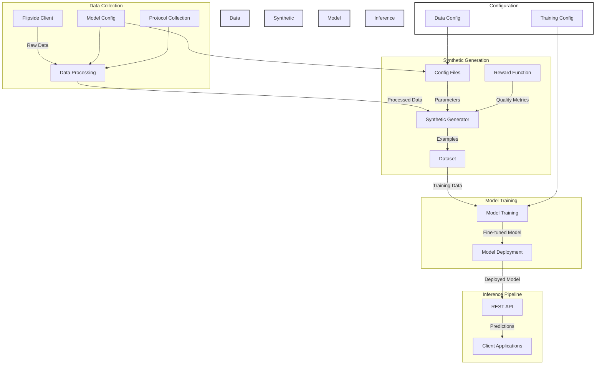

# NEAR Cortex-1: Advanced Crypto Market Reasoning AI

A specialized AI model that combines chain-of-thought reasoning with cross-chain data analysis to understand and predict crypto market dynamics. Built on Llama 3.3 70B and enhanced through GRPO (Group Policy Optimization), Cortex-1 aims to reason about market dynamics the way experienced traders do, but at a massive scale and with perfect recall of historical patterns.

## 💡 Open Source Commitment

We believe in the power of open collaboration and are committed to making Cortex-1 fully accessible to the developer community:

- **Open Source Dataset**: Our synthetic training dataset will be publicly available, providing developers with high-quality, labeled examples of crypto market reasoning
- **Open Model Weights**: Once trained, the complete model weights will be open-sourced for the community
- **Transparent Development**: All training code, reward functions, and benchmarking tools are open source
- **Developer-First**: Built as a tool for developers to integrate advanced market reasoning into their applications

Our goal is to create a foundation for the community to build upon, whether you're developing trading strategies, market analysis tools, or educational platforms.

## 🌟 Key Features

- **Chain-of-Thought Reasoning**: Detailed step-by-step analysis of market conditions
- **Cross-Chain Analysis**: Deep understanding of relationships between different blockchain networks
- **Quantitative Predictions**: Data-driven forecasting with confidence intervals
- **Risk Assessment**: Comprehensive evaluation of technical, market, and systemic risks
- **Opportunity Detection**: Identification of market inefficiencies and arbitrage opportunities

## 🏗 Architecture



### Component Details

1. **Data Collection Layer**
   - Flipside Client: Fetches raw blockchain data
   - Market Conditions: Analyzes and labels market states
   - Protocol Collection: Gathers DeFi protocol metrics

2. **Synthetic Generation Layer**
   - Config-driven generation pipeline
   - Reward function for quality assessment
   - Multi-chain data integration
   - Template-based prompt generation

3. **Model Training Layer**
   - GRPO (Group Policy Optimization)
   - Distributed training support
   - Quantization options (4-bit/8-bit)
   - Checkpoint management

4. **Inference Pipeline**
   - REST API for predictions
   - Batch and streaming inference
   - Load balancing and scaling
   - Monitoring and logging

### Data Flow

1. Raw data is collected from multiple chains via Flipside
2. Data is processed and enriched with market conditions
3. Synthetic generator creates training examples
4. Quality metrics are calculated for each example
5. Training pipeline fine-tunes the model
6. Deployed model serves predictions via API

### Configuration System

- **Data Config**: Controls data collection and processing
- **Model Config**: Defines model architecture and parameters
- **Training Config**: Manages training hyperparameters
- **DeepSpeed Config**: Optimizes distributed training

## 🎯 Core Capabilities

1. **Market Analysis & Prediction**
   - Historical pattern recognition
   - Cross-chain correlation analysis
   - Transaction volume forecasting
   - User behavior analysis

2. **Protocol Analysis**
   - Performance metrics evaluation
   - Growth trajectory analysis
   - Risk factor assessment
   - Optimization recommendations

3. **Risk Management**
   - Technical risk quantification
   - Market exposure analysis
   - Systemic risk assessment
   - Mitigation strategy development

4. **Opportunity Discovery**
   - Arbitrage opportunity detection
   - Yield optimization strategies
   - Market inefficiency analysis
   - Entry/exit point identification

## 🛠 Technical Architecture

### Base Model

- **Foundation**: Llama 3.3 70B Instruct
- **Enhancement**: GRPO (Group Policy Optimization) fine-tuning
- **Quantization**: 4-bit and 8-bit options for efficient deployment

### Training Pipeline

1. **Synthetic Data Generation**
   - Market condition balancing
   - Chain-of-thought reasoning examples
   - Cross-chain correlation scenarios
   - Protocol performance analysis cases
   - Risk assessment simulations

2. **Reward Function Components**
   - Prediction accuracy scoring
   - Reasoning depth evaluation
   - Technical analysis quality
   - Market understanding assessment
   - Cross-chain analysis metrics
   - Group policy optimization

3. **Benchmarking Framework**
   - Historical prediction accuracy
   - Reasoning quality metrics
   - Cross-chain correlation accuracy
   - Protocol analysis precision
   - Real-world performance testing

## 🚀 Getting Started

### Prerequisites

- Python 3.10+
- CUDA-compatible GPU(s)
- 192GB+ RAM for data preprocessing
- Cloud GPU access (A100/H100) for training

### Installation

1. Clone the repository:
```bash
git clone https://github.com/near/cortex-1.git
cd cortex-1
```

2. Create a virtual environment:
```bash
python -m venv venv
source venv/bin/activate  # On Windows: venv\Scripts\activate
```

3. Install dependencies:
```bash
pip install -r requirements.txt
```

4. Set up environment variables:
```bash
cp .env.example .env
# Edit .env with your API keys:
# - OPENAI_API_KEY (for synthetic data generation)
# - FLIPSIDE_API_KEY (for market data)
```

## 📊 Data Pipeline

### Market Data Collection

```bash
python scripts/collect_data.py --days 180 --chains ethereum near
```

### Synthetic Data Generation
```bash
python scripts/generate_synthetic.py \
    --days 180 \
    --samples-per-day 10 \
    --chains ethereum near \
    --protocols uniswap \
    --model o3-mini
```

### Quality Testing

```bash
python scripts/test_synthetic.py
```

## 🔍 Benchmarking

Our comprehensive benchmarking suite evaluates:

1. **Prediction Accuracy**
   - Transaction volume forecasting
   - User growth projections
   - Price movement predictions
   - Cross-chain correlation accuracy

2. **Reasoning Quality**
   - Chain-of-thought completeness
   - Logical consistency
   - Data citation accuracy
   - Technical analysis depth

3. **Real-World Performance**
   - Strategy backtesting
   - Market simulation
   - Live prediction tracking
   - Cross-chain arbitrage detection

## 🤝 Contributing

We welcome contributions! Here's how you can help:

1. **Code Contributions**
   - Fork the repository
   - Create a feature branch
   - Submit a pull request

2. **Data Contributions**
   - Historical market data
   - Protocol performance metrics
   - Cross-chain correlation data
   - Benchmark test cases

3. **Documentation**
   - Technical documentation
   - Use case examples
   - Benchmark results
   - Tutorial creation

4. **Model Development**
   - Fine-tuning improvements
   - Synthetic data generation
   - Reward function optimization
   - Benchmarking scenarios

## 🔗 Developer Resources

- **Dataset Access**: Full synthetic dataset available at [HuggingFace Datasets](https://huggingface.co/datasets/near/cortex-1)
- **Model Weights**: Pre-trained and fine-tuned weights will be published on [HuggingFace Models](https://huggingface.co/near)
- **Integration Examples**: Check our [examples](./examples) directory for implementation guides
- **API Documentation**: Comprehensive API docs available in our [Wiki](https://github.com/near/cortex-1/wiki)

## 📜 License

This project is licensed under the MIT License. See the [LICENSE](LICENSE) file for details.

## 🙏 Acknowledgments

- NEAR Foundation for support and guidance
- Unsloth Team for GRPO implementation
- Flipside Crypto for market data access
- OpenAI for synthetic data generation support

## 📚 Documentation

For detailed documentation, visit our [Wiki](https://github.com/near/cortex-1/wiki).

## 🔗 Links

- [NEAR Foundation](https://near.foundation/)
- [Project Documentation](https://near-foundation.notion.site/NEAR-Cortex-1-AI-Reasoning-Model)
- [Training Plan](docs/TRAINING_PLAN.md)
- [Contribution Guide](CONTRIBUTING.md)

## 📧 Contact

For questions or support, please open an issue or contact the NEAR Foundation team.
