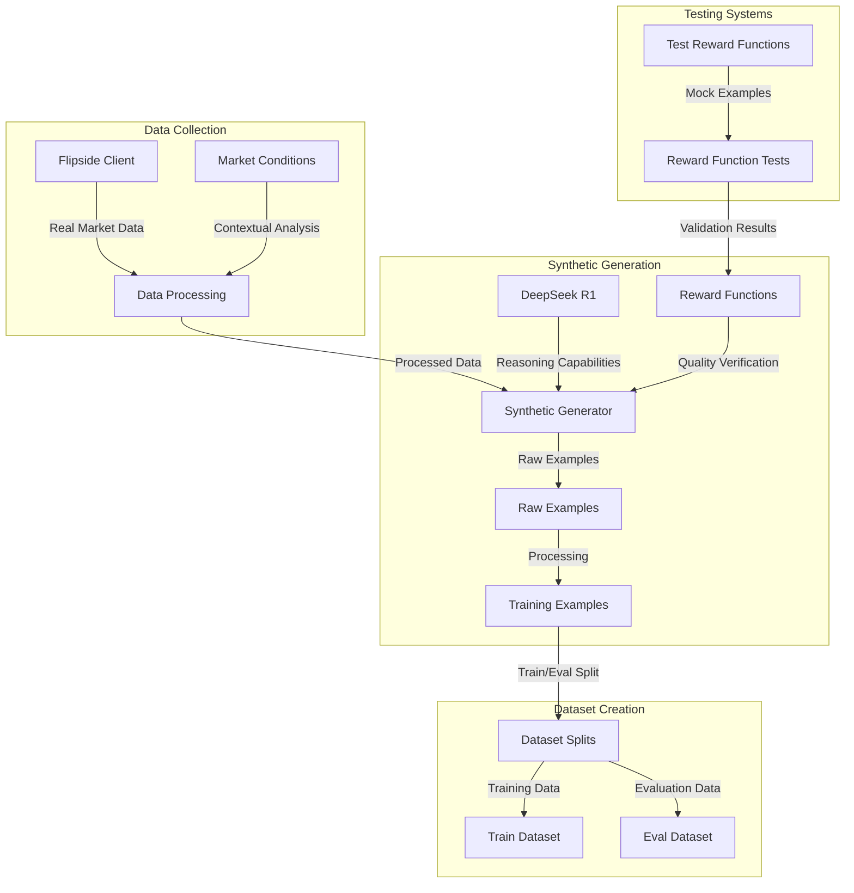

# NEAR Cortex-1 Data Pipeline

This document outlines the data pipeline architecture for NEAR Cortex-1, explaining how we generate synthetic financial analysis data with DeepSeek R1 reasoning capabilities.

## Pipeline Overview



## Main Pipeline Components

### 1. Data Collection

- **Flipside Client** (`src/data/flipside_client.py`)
  - Fetches real blockchain data from the Flipside API
  - Provides market metrics for multiple chains (e.g., NEAR, Ethereum)

- **Market Conditions** (`src/data/market_conditions.py`)
  - Analyzes market data to determine market conditions
  - Provides contextual information for the synthetic generator

### 2. Synthetic Generation

- **Synthetic Generator** (`src/data/synthetic_generator.py`)
  - Core component that integrates real data with DeepSeek R1
  - Creates prompts designed to elicit detailed reasoning
  - Handles quality verification using reward functions

- **OpenRouter Client** (`src/model/openrouter_client.py`)
  - Connects to DeepSeek R1 via OpenRouter API
  - Manages prompt submission and response handling

### 3. Dataset Creation

- **Generate Synthetic Script** (`scripts/generate_synthetic.py`)
  - Orchestrates the synthetic data generation process
  - Handles CLI arguments and configuration
  - Creates train/eval splits from generated examples

## Separate Testing System

The testing system is completely separate from the main data pipeline, designed to validate reward functions independently:

### Test Reward Functions

- **Test Rewards Script** (`scripts/test_rewards.py`)
  - Uses predefined mock examples of varying quality (high, medium, low)
  - Tests each reward function in isolation
  - Verifies that reward functions correctly differentiate quality levels

- **Evaluate Rewards Script** (`scripts/evaluate_rewards.py`)
  - Runs statistical analysis on reward function performance
  - Generates visualizations of reward distributions
  - Helps calibrate reward weights and thresholds

## Data Flow

1. **Collection**: Flipside client fetches real blockchain data
2. **Enrichment**: Market conditions are analyzed and added
3. **Generation**: DeepSeek R1 generates detailed reasoning
4. **Verification**: Reward functions verify quality
5. **Processing**: Raw examples are converted to training pairs
6. **Splitting**: Data is split into training and evaluation sets

## Reward Function Testing Flow

1. **Mock Generation**: Create synthetic examples of varied quality
2. **Testing**: Apply reward functions to these examples
3. **Validation**: Verify that scores match expected ranges
4. **Calibration**: Adjust reward weights and thresholds based on results

## File Formats

### Raw Examples
```json
{
  "date": "2025-02-09",
  "chain": "ethereum",
  "input": "You are analyzing ethereum blockchain data for 2025-02-09...",
  "reasoning": "Detailed chain-of-thought reasoning generated by DeepSeek R1...",
  "output": "Concise summary with key insights...",
  "market_data": {
    "daily_txns": 1234567,
    "unique_users": 98765,
    "total_volume": 12345.67,
    "...": "..."
  },
  "quality_score": 0.92,
  "model": "deepseek/deepseek-r1:free",
  "timestamp": "2025-02-09T11:38:41.123456"
}
```

### Training Examples
```json
{
  "input": "You are analyzing ethereum blockchain data for 2025-02-09...",
  "output": "Concise summary with key insights...",
  "reasoning": "Detailed chain-of-thought reasoning generated by DeepSeek R1...",
  "metadata": {
    "source": "synthetic",
    "model": "deepseek-r1",
    "generation_date": "2025-02-09T11:38:41.123456",
    "has_reasoning": true,
    "word_count": 842
  }
}
```

## Usage

### Main Pipeline

```bash
# Generate a small dataset (50 examples)
python scripts/generate_synthetic.py --dataset-size small --chains market

# Generate a large dataset with multiple chains
python scripts/generate_synthetic.py --dataset-size large --chains market token protocol
```

### Testing System

```bash
# Test reward functions with mock examples
python scripts/test_rewards.py --verbose

# Evaluate reward distributions on a dataset
python scripts/evaluate_rewards.py --input data/training/financial_analysis/synthetic_medium_1_chains_202503010915.jsonl
```

## Key Benefits of Separation

1. **Development Efficiency**: Reward functions can be developed and tested independently
2. **Controlled Testing**: Mock examples provide consistent test cases for reward functions
3. **Pipeline Reliability**: Main pipeline only uses validated reward functions
4. **Clear Responsibilities**: Each component has a well-defined purpose
5. **Reproducibility**: Test results are consistent and reproducible

This separation ensures that our quality verification system is robust before applying it to real data, while maintaining a clean and efficient main data pipeline. 